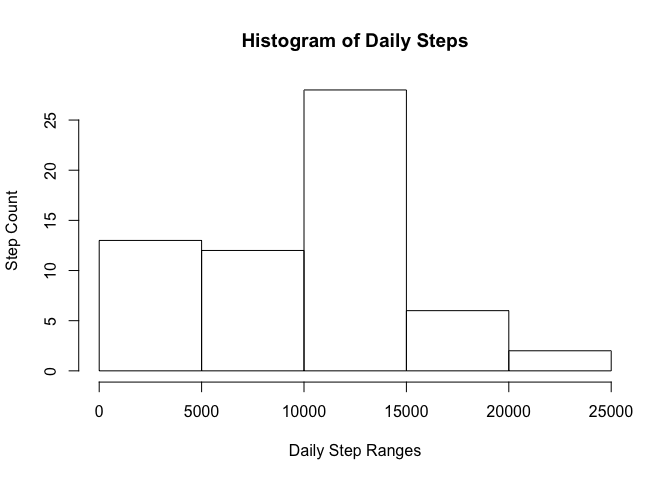
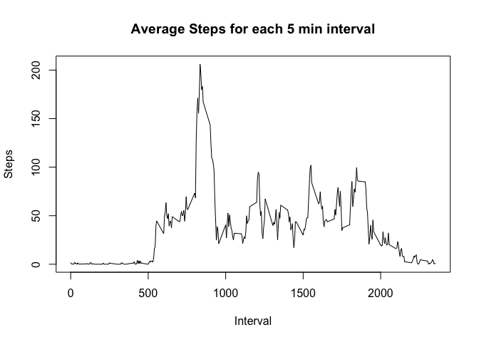
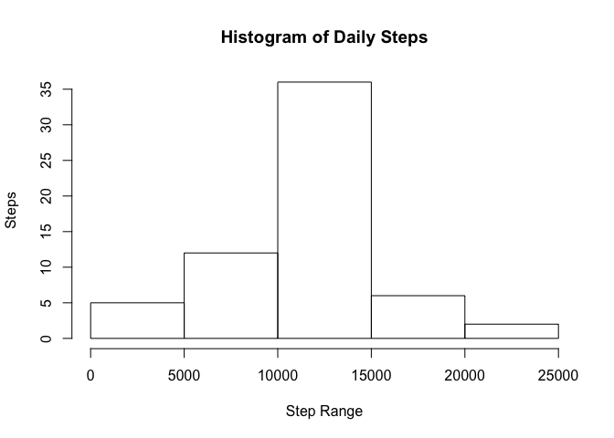

# Reproducible Research: Peer Assessment 1
## Load libraries

```r
library(dplyr)
```

```
## 
## Attaching package: 'dplyr'
```

```
## The following objects are masked from 'package:stats':
## 
##     filter, lag
```

```
## The following objects are masked from 'package:base':
## 
##     intersect, setdiff, setequal, union
```

## Loading and preprocessing the data

```r
act <- read.csv("activity.csv", stringsAsFactors = FALSE)
summary(act)
```

```
##      steps            date              interval     
##  Min.   :  0.00   Length:17568       Min.   :   0.0  
##  1st Qu.:  0.00   Class :character   1st Qu.: 588.8  
##  Median :  0.00   Mode  :character   Median :1177.5  
##  Mean   : 37.38                      Mean   :1177.5  
##  3rd Qu.: 12.00                      3rd Qu.:1766.2  
##  Max.   :806.00                      Max.   :2355.0  
##  NA's   :2304
```

Since there is a date value, we will convert that into a date class.

```r
act_date <- as.Date(act$date)
```


There are many NA's in the Steps column, we'll convert those to zero to avoid issues with plotting.

```r
act$steps <- as.integer(act$steps)
```

## What is mean total number of steps taken per day?

First we group the steps by day.


```r
act_day <- summarize(group_by(act,date), 
                     steps = sum(steps, na.rm = TRUE))

print(act_day)
```

```
## # A tibble: 61 × 2
##          date steps
##         <chr> <int>
## 1  2012-10-01     0
## 2  2012-10-02   126
## 3  2012-10-03 11352
## 4  2012-10-04 12116
## 5  2012-10-05 13294
## 6  2012-10-06 15420
## 7  2012-10-07 11015
## 8  2012-10-08     0
## 9  2012-10-09 12811
## 10 2012-10-10  9900
## # ... with 51 more rows
```

```r
hist(act_day$steps)
```

<!-- -->

Now we calculate the Mean and Median

```r
daily_steps_mean <- round(mean(act_day$steps))
print(paste("Average Daily Steps is", daily_steps_mean))
```

```
## [1] "Average Daily Steps is 9354"
```

```r
daily_steps_med <- round(median(act_day$steps))
print(paste("Median Daily Steps is", daily_steps_med))
```

```
## [1] "Median Daily Steps is 10395"
```


## What is the average daily activity pattern?
First we make a time series chart of all 5 min5ute intervals and calculate the average steps taken every 5 min5utes.

```r
min5 <- summarise(group_by(act,interval), steps = mean(steps, na.rm = TRUE))

plot(min5$interval, min5$steps, type = "l", main = "Average Steps for each interval", xlab = "Interval", ylab = "Steps")
```

<!-- -->

```r
max_pos <- match(max(min5$steps),min5$steps)
print( paste0("The highest steps interval is ", min5$interval[max_pos] ) )
```

```
## [1] "The highest steps interval is 835"
```

## Inputing missing values
First we check for how many incomplete rows there are: 

```r
act2 <- act
for(i in names(act2)){
    print(paste0("Column ", i, 
                 " has ",
                 sum(is.na(act2[i])) ,
                 " NA's"))
}
```

```
## [1] "Column steps has 2304 NA's"
## [1] "Column date has 0 NA's"
## [1] "Column interval has 0 NA's"
```
There are 2304 incomplete rows all in the steps column.  We will attempt to substitute and fill in those empty cells with the mean across all intervals.


```r
    pos <- 0
    for( i in act2$steps){
        pos <- pos + 1
        if(is.na(i)){
            inter <- act2$interval[pos]
            inter_pos <- which(act2$interval == inter)
            int_mean <- mean(act2$steps[inter_pos], na.rm = TRUE)
            act2$steps[pos] <- round(int_mean)
        }
    }
```

Now we look at the new stats for the filled in dataframe:

```r
act2_day <- summarize(group_by(act2,date), 
                     steps = sum(steps, na.rm = TRUE))

daily_steps_mean2 <- round(mean(act2_day$steps))
print(paste("Average Daily Steps is with filled in values", daily_steps_mean2))
```

```
## [1] "Average Daily Steps is with filled in values 10766"
```

```r
daily_steps_med2 <- round(median(act2_day$steps))
print(paste("Median Daily Steps with filled in values is", daily_steps_med2))
```

```
## [1] "Median Daily Steps with filled in values is 10762"
```

```r
hist(act2_day$steps)
```

<!-- -->

After filling the values, it is clear from the historgrams that the daily step values have shifted toward the median.

## Are there differences in activity patterns between weekdays and weekends?

We first label what day of the week each date is and break the data down inbetween weekend and weekday


```r
wk <- weekdays(as.Date(act2$date), abbreviate = TRUE)
act3 <- cbind(act2,wk)
wkend <- subset(act3, act3$wk == "Sun"|act3$wk == "Sat")
wkday <- subset(act3, act3$wk != "Sun" & act3$wk != "Sat")
```

Now we plot the 2 data sets


```r
wkday_sum <- summarise(group_by(wkday,interval), steps = mean(steps, na.rm = TRUE))

plot(wkday_sum$interval, wkday_sum$steps, type = "l", main = "Weekday vs Weekend Step Pattern", xlab = "Interval", ylab = "Steps", ylim = c(0,300), col = "blue")

wkend_sum <- summarise(group_by(wkend,interval), steps = mean(steps, na.rm = TRUE))

lines(wkend_sum$interval, wkend_sum$steps, col = "green")
legend("topright", c("Weekday","Weekend"),col = c("blue","green"), bg = "gray", cex = .75, lty = 1, bty = "n")
```

<!-- -->

The overlayed graphs show there is more steps taken during weekday mornings, and then some more in the evening while the weekends have a more even spread of walking throughout the day.
